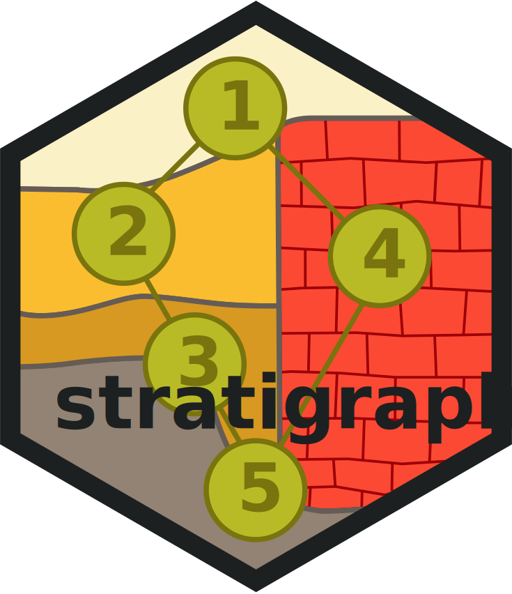

# stratigraphr 

<!-- badges: start -->
[](https://www.tidyverse.org/lifecycle/#experimental)
[](https://CRAN.R-project.org/package=stratigraphr)
<!-- badges: end -->

stratigraphr is a tidy framework for working with archaeological stratigraphy and chronology in R.
It includes tools for reading, analysing, and visualising stratigraphies ("Harris matrices") and sequences as directed graphs;
helper functions for using radiocarbon dates in a tidy data analysis; 
and an R interface to OxCal's Chronological Query Language (CQL).

## Installation

You can install the development version of stratigraphr from GitHub:

```r
# install.packages("devtools")
devtools::install_github("joeroe/stratigraphr")
```

Please note that this package is in an early stage of development.
It is functional, but many features are missing and future versions are likely to contain breaking changes.

## Usage

* Graph-bases stratigraphic analysis: see `vignette("harris")`.
* Tidy analysis of radiocarbon dates: see [examples](https://twitter.com/joeroe90/status/1102887126004310017).
* Chronological query language: see `vignette("cql")`.
