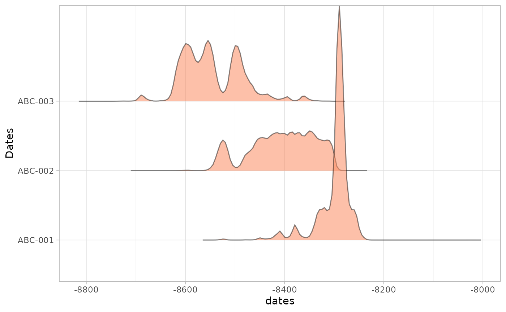
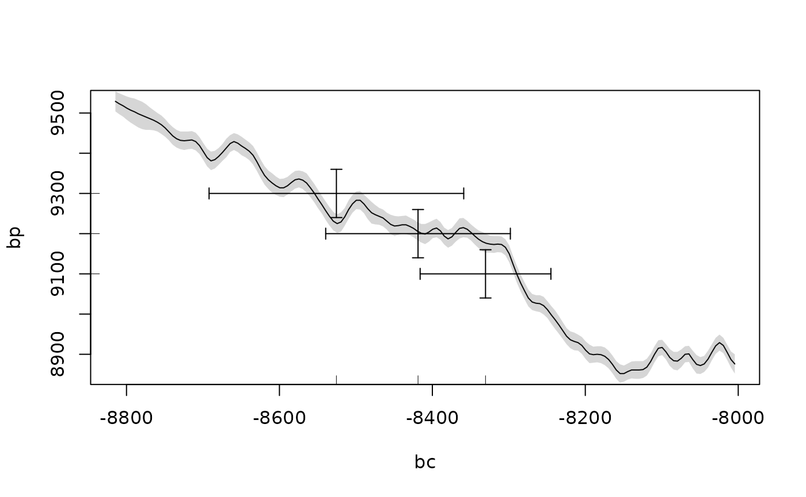

# Chronological Query Language (CQL)

The Chronological Query Language (CQL) is a tool for formally describing
chronological models (Bronk Ramsey 1998). It is most commonly used to
input data for Bayesian radiocarbon calibration in
[OxCal](https://c14.arch.ox.ac.uk/oxcal.html) (Bronk Ramsey 2009).
`stratigraphr` includes an R interface for CQL2, the version used in
OxCal v3+.

This vignette describes how to use this interface to generate CQL models
in R.

## Overview

- Individual CQL commands (see
  <https://c14.arch.ox.ac.uk/oxcalhelp/hlp_commands.html>) are
  implemented as `cql_*` functions.
- Use [`cql()`](../reference/cql.md) to group together CQL functions or
  include arbitrary CQL code.
- Execute CQL scripts in OxCal using
  [`write_oxcal()`](../reference/write_oxcal.md) or the [oxcAAR
  package](https://CRAN.R-project.org/package=oxcAAR).

## Writing CQL models

``` r

library("stratigraphr")
```

## Generating CQL models from other types of data

Used in the simple way above, `stratigraphr`’s CQL interface offers
little benefit over writing CQL directly. Its real power is in combining
[`cql()`](../reference/cql.md) with other R tools to build models based
on other data.

For the following examples, we will use stratigraphic and radiocarbon
data from Shubayqa 1 (Richter et al. 2017):

``` r

data("shub1")
data("shub1_radiocarbon")
```

### Tabular data

With radiocarbon and stratigraphic data in a tabular format, you can
take advantage of `dplyr`’s powerful tools for data manipulation to
build CQL models programmatically.

For example, use
[`dplyr::mutate()`](https://dplyr.tidyverse.org/reference/mutate.html)
to concisely express a table of dates as CQL `R_Date` commands:

``` r

library("purrr")
library("dplyr")
#> 
#> Attaching package: 'dplyr'
#> The following objects are masked from 'package:stats':
#> 
#>     filter, lag
#> The following objects are masked from 'package:base':
#> 
#>     intersect, setdiff, setequal, union

shub1_radiocarbon %>% 
  mutate(r_date = cql_r_date(lab_id, cra, error)) %>% 
  pluck("r_date") %>% 
  cql()
#>  // CQL2 generated by stratigraphr v0.3.0.9000
#>  R_Date("RTD-7951", 12166, 55);
#>  R_Date("Beta-112146", 12310, 60);
#>  R_Date("RTD-7317", 12289, 46);
#>  R_Date("RTD-7318", 12332, 46);
#>  R_Date("RTD-7948", 12478, 38);
#>  R_Date("RTD-7947", 12322, 38);
#>  R_Date("RTD-7313", 12346, 46);
#>  R_Date("RTD-7311", 12367, 65);
#>  R_Date("RTD-7312", 12405, 50);
#>  R_Date("RTD-7314", 12273, 48);
#>  R_Date("RTD-7316", 12337, 46);
#>  R_Date("RTD-7315", 12445, 70);
#>  R_Date("RTK-6818", 12477, 76);
#>  R_Date("RTK-6820", 12385, 75);
#>  R_Date("RTK-6821", 12385, 78);
#>  R_Date("RTK-6822", 12412, 79);
#>  R_Date("RTK-6823", 12321, 78);
#>  R_Date("RTK-6813", 12344, 85);
#>  R_Date("RTK-6816", 12389, 78);
#>  R_Date("RTK-6819", 11325, 74);
#>  R_Date("RTK-6812", 11365, 72);
#>  R_Date("RTK-6817", 11322, 75);
#>  R_Date("RTD-8904", 10317, 38);
#>  R_Date("RTK-6814", 10229, 70);
#>  R_Date("RTD-8902", 10107, 53);
#>  R_Date("RTD-8903", 10095, 52);
#>  R_Date("RTK-6815", 1229, 54);
```

Or use
[`dplyr::group_by()`](https://dplyr.tidyverse.org/reference/group_by.html)
and
[`dplyr::summarise()`](https://dplyr.tidyverse.org/reference/summarise.html)
to build phase models. This is a three stage process, illustrated below
with the phase model from Shubayqa 1:

1.  Preprocess the dates, e.g. to remove outliers and order phases.
2.  Group dates by phase and summarise them with
    [`cql_phase()`](../reference/cql_phase.md).
3.  Group phases into a sequence, using `boundaries` to automatically
    add boundary constraints between them. If we had multiple
    independent sequences, we could include an additional grouping
    variable here, before concatenating them with
    [`cql()`](../reference/cql.md).

``` r

shub1_radiocarbon %>% 
  filter(!outlier) %>% 
  group_by(phase) %>% 
  summarise(cql = cql_phase(phase, cql_r_date(lab_id, cra, error))) %>% 
  arrange(desc(phase)) %>% 
  summarise(cql = cql_sequence("Shubayqa 1", cql, boundaries = TRUE)) %>%
  pluck("cql") %>%
  cql() ->
  shub1_cql

shub1_cql
#>  // CQL2 generated by stratigraphr v0.3.0.9000
#>  Sequence("Shubayqa 1")
#>  {
#>   Boundary("");
#>   Phase("Phase 7")
#>   {
#>    R_Date("RTD-7951", 12166, 55);
#>    R_Date("Beta-112146", 12310, 60);
#>    R_Date("RTD-7317", 12289, 46);
#>    R_Date("RTD-7318", 12332, 46);
#>    R_Date("RTD-7948", 12478, 38);
#>   };
#>   Boundary("");
#>   Phase("Phase 6")
#>   {
#>    R_Date("RTD-7947", 12322, 38);
#>    R_Date("RTD-7313", 12346, 46);
#>    R_Date("RTD-7311", 12367, 65);
#>    R_Date("RTD-7312", 12405, 50);
#>    R_Date("RTD-7314", 12273, 48);
#>    R_Date("RTD-7316", 12337, 46);
#>    R_Date("RTD-7315", 12445, 70);
#>   };
#>   Boundary("");
#>   Phase("Phase 5")
#>   {
#>    R_Date("RTK-6818", 12477, 76);
#>    R_Date("RTK-6820", 12385, 75);
#>    R_Date("RTK-6821", 12385, 78);
#>    R_Date("RTK-6822", 12412, 79);
#>    R_Date("RTK-6823", 12321, 78);
#>   };
#>   Boundary("");
#>   Phase("Phase 4")
#>   {
#>    R_Date("RTK-6813", 12344, 85);
#>    R_Date("RTK-6816", 12389, 78);
#>   };
#>   Boundary("");
#>   Phase("Phase 3")
#>   {
#>    R_Date("RTK-6819", 11325, 74);
#>   };
#>   Boundary("");
#>   Phase("Phase 2")
#>   {
#>    R_Date("RTK-6812", 11365, 72);
#>    R_Date("RTK-6817", 11322, 75);
#>   };
#>   Boundary("");
#>   Phase("Phase 1")
#>   {
#>    R_Date("RTD-8904", 10317, 38);
#>    R_Date("RTK-6814", 10229, 70);
#>    R_Date("RTD-8902", 10107, 53);
#>    R_Date("RTD-8903", 10095, 52);
#>   };
#>   Boundary("");
#>  };
```

### Stratigraphs

…

## Running CQL models

You can run models generated by [`cql()`](../reference/cql.md) using the
desktop or online versions of OxCal by simply copying the output into
the program. Alternatively, use
[`write_oxcal()`](../reference/write_oxcal.md) to create a .oxcal file:

``` r

oxcal_cql <- cql(
  cql_r_date("ABC-001", 9100, 30),
  cql_r_date("ABC-002", 9200, 30),
  cql_r_date("ABC-003", 9300, 30)
)

write_oxcal(oxcal_cql, "cql.oxcal")
```

You can also run OxCal directly through R using the
[oxcAAR](https://CRAN.R-project.org/package=oxcAAR) package. This
depends on a local installation of OxCal. If you already have one
installed, you can set the path to the executable using
[`oxcAAR::setOxcalExecutablePath()`](https://rdrr.io/pkg/oxcAAR/man/setOxcalExecutablePath.html).
Otherwise, use
[`oxcAAR::quickSetupOxcal()`](https://rdrr.io/pkg/oxcAAR/man/quickSetupOxcal.html)
to download one, for example to a temporary directory:

``` r

library("oxcAAR")
quickSetupOxcal(path = tempdir())
```

You can then use
[`oxcAAR::executeOxcalScript()`](https://rdrr.io/pkg/oxcAAR/man/executeOxcalScript.html)
to run the CQL script and
[`oxcAAR::readOxcalOutput()`](https://rdrr.io/pkg/oxcAAR/man/readOxcalOutput.html)
to read the output back into R.

``` r

executeOxcalScript(oxcal_cql) %>% 
  readOxcalOutput() ->
  oxcal_output
```

You can parse the output with
[`oxcAAR::parseOxcalOutput()`](https://rdrr.io/pkg/oxcAAR/man/parseOxcalOutput.html)
and visualise it using `oxcAAR`’s built-in plotting functions:

``` r

oxcal_parsed <- oxcAAR::parseOxcalOutput(oxcal_output)
plot(oxcal_parsed)
calcurve_plot(oxcal_parsed)
```



The current CRAN version of oxcAAR (v. 1.0.0) does not read the
posterior probabilities produced by a model with Bayesian calibration,
so to work with these you need to install the latest development version
(`devtools::install_github("ISAAKiel/oxcAAR")`). With this,
[`oxcAAR::parseOxcalOutput()`](https://rdrr.io/pkg/oxcAAR/man/parseOxcalOutput.html)
also contains the modelled results in `$posterior_sigma_ranges` and
`$posterior_probabilities`. Again, you can quickly visualise these with
the built-in plotting functions:

``` r

# Not run: slow
# shub1_oxcal <- executeOxcalScript(shub1_cql)
# readOxcalOutput(shub1_oxcal) %>% 
#   parseOxcalOutput() %>% 
#   plot()
```

## References

Bronk Ramsey, Christopher. 1998. “Probability and Dating.” *Radiocarbon*
40 (1): 461–74.

Bronk Ramsey, Christopher. 2009. “Bayesian Analysis of Radiocarbon
Dates.” *Radiocarbon* 51 (1): 337–60.
<https://doi.org/10.1017/S0033822200033865>.

Richter, Tobias, Amaia Arranz-Otaegui, Lisa Yeomans, and Elisabetta
Boaretto. 2017. “High Resolution AMS Dates from Shubayqa 1, Northeast
Jordan Reveal Complex Origins of Late Epipalaeolithic Natufian in the
Levant.” *Scientific Reports* 7 (1): 17025.
<https://doi.org/10.1038/s41598-017-17096-5>.
