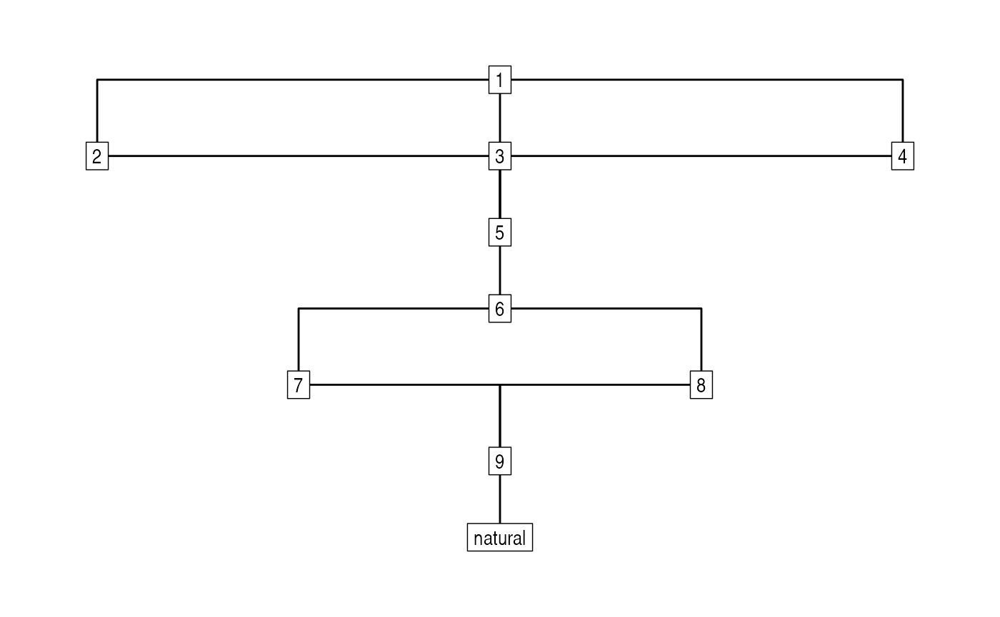

# Stratigraphic graphs

``` r

library("stratigraphr")
library("ggraph")
#> Loading required package: ggplot2

# Example data after Harris 1979, Fig. 12
data("harris12")
h12_graph <- stratigraph(harris12, "context", "above")

ggraph(h12_graph, layout = "sugiyama") +
  geom_edge_elbow() +
  geom_node_label(aes(label = context), label.r = unit(0, "mm")) +
  theme_graph()
```


