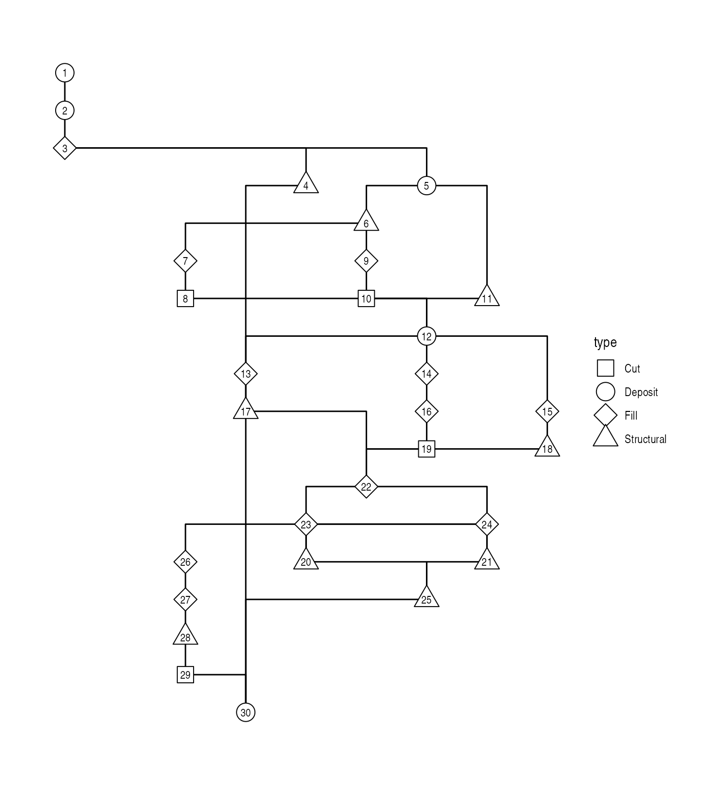

# Stratigraphic graphs

`stratigraphr` provides a tidy framework for working with archaeological
stratigraphy as a graph data structure in R. This vignette introduces
the core functions for constructing, validating, and visualising
stratigraphic graphs (a ‘Harris matrix’), and demonstrates how they
integrate with the broader tidygraph ecosystem.

## Terminology

Archaeological stratigraphy records the depositional history of a site
as a set of **units**[^1] and their relative temporal ordering as
determining by the law of superposition (Harris 1979). A **stratigraphic
graph** is the formal representation of this information: a directed
acyclic graph where nodes represent units and directed edges represent
stratigraphic **relations** (Dye and Buck 2015).

The **Harris matrix** is the conventional visual representation of a
stratigraphic graph, where units are arranged in boxes and lines
indicate direct stratigraphic relations (Harris 1979). While the terms
are sometimes used interchangeably in archaeological literature, it is
useful to distinguish the abstract data structure (the stratigraphic
graph) from its visual representation (the Harris matrix).

Other information commonly featured on Harris matrices – such as unit
equivalencies, the distinction between deposits and interfaces, unit
types, or phase assignments – are not part of the pure stratigraphic
graph. They are associated information that can be used for display,
analysis, or modelling, but the graph structure itself is determined
solely by the above/below relations between units.

## stratigraph objects

The `stratigraph` object is the package’s central data structure. It is
a specialised subclass of
[`tidygraph::tbl_graph`](https://tidygraph.data-imaginist.com/reference/tbl_graph.html),
representing a stratigraphic graph as tidy data with nodes (units) and
edges (relations).

The package includes the dataset `harris12`, a classic stratigraphic
sequence from Harris (1979, fig. 12):

``` r

library("stratigraphr")

data("harris12")
harris12
#>    context   above   below equal
#> 1        1      NA 2, 3, 4  <NA>
#> 2        2       1       5  <NA>
#> 3        3       1       5  <NA>
#> 4        4       1       5  <NA>
#> 5        5 2, 3, 4       6  <NA>
#> 6        6       5    7, 8  <NA>
#> 7        7       6       9     8
#> 8        8       6       9     7
#> 9        9    7, 8 natural  <NA>
#> 10 natural       9      NA  <NA>
```

The data frame contains a `context` column with unit labels and
list-columns (`above`, `below`, `equal`) describing the stratigraphic
relations between units. To construct the graph, we specify which column
contains the unit labels and which column describes the relations:

``` r

h12_graph <- stratigraph(harris12, "context", "above")
h12_graph
#> # A stratigraph: 10 units and 12 relations
#> # ✔ Valid stratigraphic graph
#>                 1
#> ┌───────────────┼───────────────┐
#> 2               3               4
#> └───────────────┼───────────────┘
#>                 5
#>                 │
#>                 6
#>         ┌───────┴───────┐
#>         7               8
#>         └───────┬───────┘
#>                 9
#>                 │
#>              natural
```

The `direction` argument (default `"above"`) indicates whether the
relation column lists units *above* or *below* each unit. Because
`stratigraph` inherits from `tbl_graph`, it can be manipulated using the
full suite of tidygraph and igraph functions:

``` r

library("tidygraph")

# Inspect the nodes (units)
h12_graph |>
  activate("nodes") |>
  as_tibble()
#> # A tibble: 10 × 4
#>    context above below     equal
#>    <chr>   <chr> <list>    <chr>
#>  1 1       NA    <chr [3]> NA   
#>  2 2       1     <chr [1]> NA   
#>  3 3       1     <chr [1]> NA   
#>  4 4       1     <chr [1]> NA   
#>  5 5       2     <chr [1]> NA   
#>  6 6       5     <chr [2]> NA   
#>  7 7       6     <chr [1]> 8    
#>  8 8       6     <chr [1]> 7    
#>  9 9       7     <chr [1]> NA   
#> 10 natural 9     <chr [1]> NA

# Inspect the edges (relations)
h12_graph |>
  activate("edges") |>
  as_tibble()
#> # A tibble: 12 × 2
#>     from    to
#>    <int> <int>
#>  1     1     2
#>  2     1     3
#>  3     1     4
#>  4     2     5
#>  5     3     5
#>  6     4     5
#>  7     5     6
#>  8     6     7
#>  9     6     8
#> 10     7     9
#> 11     8     9
#> 12     9    10
```

See the [tidygraph documentation](https://tidygraph.data-imaginist.com/)
for more details on tidy graph manipulation and analysis.

## Importing stratigraphic data

Stratigraphic data is fundamentally simple: a data frame of units and
relations. The
[`stratigraph()`](https://stratigraphr.joeroe.io/reference/stratigraph.md)
function expects:

- A **label column** with unique identifiers for each unit
- A **relation column** describing stratigraphic relations between units

The relation column can be either a list-column (where each element is a
vector of related units) or a regular column in long format (where each
row represents a single relation).

### Constructing from scratch

You can construct a stratigraphic data frame directly in R:

``` r

strat_data <- data.frame(
  unit = c("A", "B", "C"),
  below = c("B", "C", NA)
)

stratigraph(strat_data, "unit", "below", direction = "below")
#> # A stratigraph: 3 units and 2 relations
#> # ✔ Valid stratigraphic graph
#> A
#> │
#> B
#> │
#> C
```

### Reading from CSV

More commonly, stratigraphic data is stored in a CSV file. With
long-format input, you can read the CSV and pass it directly to
[`stratigraph()`](https://stratigraphr.joeroe.io/reference/stratigraph.md):

``` r

library("readr")

csv_text <- "context,above
A,
B,A
C,A"

strat_data <- read_csv(csv_text, show_col_types = FALSE)

stratigraph(strat_data, "context", "above")
#> # A stratigraph: 3 units and 2 relations
#> # ✔ Valid stratigraphic graph
#>   A
#> ┌─┴─┐
#> B   C
```

Stratigraphic data often includes both ‘above’ and ‘below’ columns.
These should describe the same graph from opposite perspectives. Use
[`strat_is_mirror()`](https://stratigraphr.joeroe.io/reference/strat_is_mirror.md)
to verify they are consistent:

``` r

strat_is_mirror(harris12$context, harris12$above, harris12$below)
#> [1] TRUE
```

### Reading LST files

The [`read_lst()`](https://stratigraphr.joeroe.io/reference/read_lst.md)
function reads stratigraphic data from LST format files, used by BASP
Harris, Stratify, and ArchEd:

``` r

lst_file <- system.file("extdata", "bonn.lst", package = "stratigraphr")
lst_data <- read_lst(lst_file)
stratigraph(lst_data, "name", "above")
#> # A stratigraph: 19 units and 26 relations
#> # ✔ Valid stratigraphic graph
#>                      +
#> ┌──────────────┬─────┴──┬────────┐
#> 1              27       53       │
#> │     ┌────────┤        │        │
#> 2     28       29       52       │
#> ├──┐  └──┬──┬──┴──┬─────┼─────┬──┴──┐
#> 3  │     │  42    30    44    54    │
#> │  ├─────┘  └──┬──┘     └──┬──┘     │
#> 4  41          70          35       43
#> └──┴───────────┼───────────┴────────┘
#>                -
```

It supports both the original BASP format and the extended format used
by Stratify and ArchEd – see
[`?read_lst`](https://stratigraphr.joeroe.io/reference/read_lst.md) for
details.

## Validating stratigraphic graphs

Following Dye and Buck (2015), a valid stratigraphic graph[^2] must
satisfy two properties:

1.  **It is acyclic** – it contains no cycles, i.e. no circular chains
    of relations. A cycle would mean unit A is above unit B, B is above
    C, and C is above A, violating the law of stratigraphic
    superposition.
2.  **It contains no redundant relations** – a relation is redundant if
    it is already implied by other relations through transitivity.
    Transitivity means that if A is above B and B is above C, then A is
    necessarily above C; the direct relation between A and C adds no new
    information. Per Harris’ ‘Law of Stratigraphical Succession’, only
    the uppermost and undermost relations are significant when placing a
    unit in a stratigraphic sequence.

The
[`stratigraph()`](https://stratigraphr.joeroe.io/reference/stratigraph.md)
function warns on construction if the graph is invalid, but allows you
to create and inspect invalid graphs. Use
[`strg_is_valid()`](https://stratigraphr.joeroe.io/reference/strg_is_valid.md)
for explicit checking:

``` r

strg_is_valid(h12_graph)
#> [1] TRUE
```

### Cycles

A cycle occurs when the stratigraphic relations are contradictory. This
violates the law of superposition and indicates an error in the data:

``` r

cycle_data <- data.frame(
  unit = c("A", "B", "C"),
  below = c("B", "C", "A")
)

cycle_graph <- stratigraph(cycle_data, "unit", "below", direction = "below")
```

### Redundant relations

A redundant relation is one that is already implied by transitivity. For
example, if A is above B and B is above C, then A’s position above C is
already established through the chain A–B–C. An explicit relation
between A and C is redundant and should be removed to produce a valid
stratigraphic graph.

``` r

redundant_data <- data.frame(
  unit = c("A", "B", "B", "C"),
  above = c("B", "C", "C", NA)
)

redundant_graph <- stratigraph(redundant_data, "unit", "above")
strg_is_valid(redundant_graph)
#> [1] FALSE
```

The
[`strg_prune()`](https://stratigraphr.joeroe.io/reference/strg_prune.md)
function computes the transitive reduction, removing redundant edges:

``` r

pruned_graph <- strg_prune(redundant_graph)
pruned_graph
#> # A stratigraph: 3 units and 2 relations
#> # ✔ Valid stratigraphic graph
#> C
#> │
#> B
#> │
#> A
strg_is_valid(pruned_graph)
#> [1] TRUE
```

## Plotting with ggraph

[ggraph](https://ggraph.data-imaginist.com/) extends the grammar of
graphics to network visualisation, providing a ggplot2-compatible
interface for plotting graph data. Because `stratigraph` objects inherit
from `tbl_graph`, they work seamlessly with ggraph: you can map
aesthetics, add layers, and use geoms just as you would with any other
tidy data.

The Harris matrix is the conventional visual representation of a
stratigraphic graph. We can reproduce it using ggraph with a Sugiyama
(layered) layout:

``` r

library("ggraph")

ggraph(h12_graph, layout = "sugiyama") +
  geom_edge_elbow() +
  geom_node_label(aes(label = context), label.r = unit(0, "mm")) +
  theme_graph()
```


The Sugiyama layout arranges units in horizontal layers according to
their stratigraphic position, with the earliest (lowest) units at the
bottom. The
[`geom_edge_elbow()`](https://ggraph.data-imaginist.com/reference/geom_edge_elbow.html)
geom produces the right-angled edges characteristic of Harris matrices.

### Incorporating associated information

While the stratigraphic graph itself contains only units and relations,
we can use associated information to enhance the visualisation. The
`shub1` dataset (Richter et al. 2017) includes columns for context
`type`, `phase`, and `structure`, which can be mapped to visual
aesthetics:

``` r

shub1_graph <- stratigraph(shub1, "context", "above")

ggraph(shub1_graph, layout = "sugiyama") +
  geom_edge_elbow() +
  geom_node_point(aes(shape = type), fill = "white", size = 6) +
  geom_node_text(aes(label = context), vjust = 0.5, size = 3) +
  scale_shape_manual(values = c(22, 21, 23, 24)) +
  theme_graph()
```



## Further reading

- **Chronological Query Language (CQL)**: The
  [`vignette("cql")`](https://stratigraphr.joeroe.io/articles/cql.md)
  vignette describes how to convert stratigraphic graphs into OxCal
  chronological models for Bayesian radiocarbon calibration.
- **Tidy radiocarbon analysis**: Radiocarbon analysis functions have
  moved to the [c14 package](https://c14.joeroe.io/). See its
  [introductory vignette](https://c14.joeroe.io/articles/c14.html) for
  details.
- **Graph manipulation**: The [tidygraph
  documentation](https://tidygraph.data-imaginist.com/) provides
  comprehensive coverage of graph manipulation in R.

## References

Dye, Thomas S, and Caitlin E Buck. 2015. “Archaeological Sequence
Diagrams and Bayesian Chronological Models.” *Journal of Archaeological
Science* 63 (November): 84–93.
<https://doi.org/10.1016/j.jas.2015.08.008>.

Harris, Edward C. 1979. *Principles of Archaeological Stratigraphy*.
Academic Press.

Richter, Tobias, Amaia Arranz-Otaegui, Lisa Yeomans, and Elisabetta
Boaretto. 2017. “High Resolution AMS Dates from Shubayqa 1, Northeast
Jordan Reveal Complex Origins of Late Epipalaeolithic Natufian in the
Levant.” *Scientific Reports* 7 (1): 17025.
<https://doi.org/10.1038/s41598-017-17096-5>.

[^1]: Also called contexts, loci, layers, or other terms depending on
    regional tradition.

[^2]: Or ‘archaeological sequence diagram’, in their terminology.
