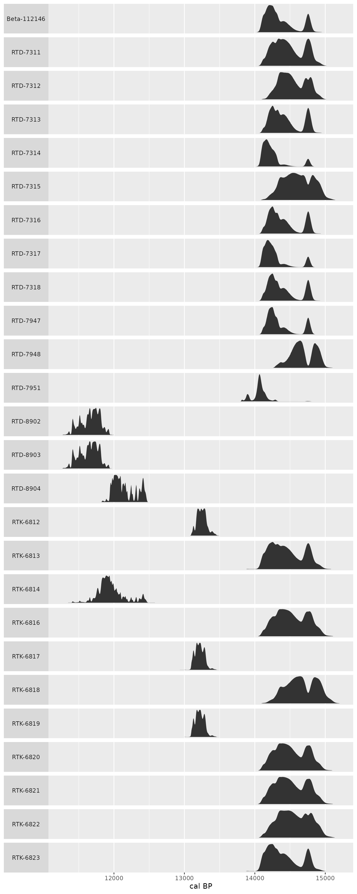

# Tidy radiocarbon analysis

``` r

library(stratigraphr)
```

stratigraphr includes a framework for working with radiocarbon dates in
a tidy data analysis.

There are many existing packages that deal with radiocarbon data in R:

- **Data retrieval and cleaning**:
  [c14bazAAR](https://docs.ropensci.org/c14bazAAR/)
- **Calibration and modelling**:
  [rcarbon](https://github.com/ahb108/rcarbon),
  [oxcAAR](https://github.com/ISAAKiel/oxcAAR),
  [RChronoModel](https://cran.r-project.org/web/packages/RChronoModel/index.html),
  [BChron](https://andrewcparnell.github.io/Bchron/),
  [bacon](http://chrono.qub.ac.uk/blaauw/bacon.md)
- **Analysis:** rcarbon (summed probability distributions, spatial
  analysis),
  [ArchaeoPhases](https://www.math.sciences.univ-nantes.fr/~philippe/ArchaeoPhases.html)
  (post-processing of Bayesian models)

The idea is not to duplicate these packages, but to provide tools that
make it easier to use them together and with other packages in the
extended [tidyverse](https://www.tidyverse.org/).

This vignette introduces some general principles for keeping radiocarbon
data and models tidy, and describes how to carry out some common
analysis tasks in that framework.

## Overview

- Keep uncalibrated dates in a tidy, tabular format (e.g. a `tibble` or
  `data.frame`) together with contextual data associated with the
  sample.
- `cal` objects are a generic representation of calibrated probability
  distributions that can be nested within tables to maintain their
  association with contextual data. Functions are provided to convert
  objects from a variety of other packages to and from the `cal` format.
- `c14_*` functions provide a consistent set of verbs for transforming
  radiocarbon data that work well with `dplyr`-style data manipulation
  and within functional analysis pipelines.

## Tidy radiocarbon data

“Tidy data” (Wickham 2014) is a set of principles for organising
datasets in a way that makes it easy to perform data analysis without
tedious “data munging” between each step. In brief, tidy datasets are
“rectangular” tables where:

1.  Every column is variable.
2.  Every row is an observation.
3.  Every cell is a single value.

Conventionally-reported uncalibrated radiocarbon dates (Millard 2014)
are readily adapted into this format. Each row should represent a single
sample, with the most important variables being the laboratory code,
conventional radiocarbon age (CRA), and standard error. Further
information about each sample, from the laboratory or about its context,
should be stored in additional commons. The `shub1-radiocarbon` dataset
(Richter et al. 2017), including with this package, is an example of
tidy radiocarbon data in a `tibble`:

``` r

data("shub1_radiocarbon")
head(shub1_radiocarbon)
#>        lab_id context   phase                           sample
#> 1    RTD-7951      23 Phase 7         Context 126, Sample #465
#> 2 Beta-112146      24 Phase 7                        SHUB1/105
#> 3    RTD-7317      26 Phase 7          Context 83, Sample #392
#> 4    RTD-7318      27 Phase 7          Context 86, Sample #399
#> 5    RTD-7948      24 Phase 7         Context 120, Sample #455
#> 6    RTD-7947      22 Phase 6 Context 166, K25.14, Sample #430
#>                    material   cra error outlier
#> 1 Bolboschoenus sp. (tuber) 12166    55   FALSE
#> 2          gazelle dung (?) 12310    60   FALSE
#> 3 Bolboschoenus sp. (tuber) 12289    46   FALSE
#> 4 Zilla sp. (wood charcoal) 12332    46   FALSE
#> 5 Bolboschoenus sp. (tuber) 12478    38   FALSE
#> 6 Bolboschoenus sp. (tuber) 12322    38   FALSE
```

Radiocarbon data from other sources might require some cleaning to get
it into this format. [tidyr](https://tidyr.tidyverse.org/) is a useful
package for this (see
[shub1_radiocarbon.R](https://github.com/joeroe/stratigraphr/blob/master/data-raw/shub1_radiocarbon.R)
for an example of how tidyr was used to clean the Shubayqa 1 dataset).
Or if you are working with dates aggregated from multiple sources,
[c14bazAAR](https://docs.ropensci.org/c14bazAAR/) package provides many
useful tools for automatically querying published databases and cleaning
the results.

For this vignette, we will stick with the shub1 dataset.

## Calibration

The first step in any analysis of radiocarbon data is likely to be
calibration. In `dplyr`’s grammar, calibration is a *mutation* of the
original (uncalibrated) data; it creates a new variable (the calibrated
probability distribution) for each observation based on a transformation
based on some of the original variables (`cra`, `error`) and a number of
other, fixed parameters (e.g. the calibration curve). Performing
calibration with
[`dplyr::mutate()`](https://dplyr.tidyverse.org/reference/mutate.html)
is useful because it allows us to keep the result of this transformation
together with the input data and associated contextual information.

[`c14_calibrate()`](../reference/c14_calibrate.md) is a wrapper for
[`rcarbon::calibrate()`](https://rdrr.io/pkg/rcarbon/man/calibrate.html)
that can be used within `dplyr` statements:

``` r

library("dplyr")

shub1_radiocarbon %>% 
  mutate(cal = c14_calibrate(cra, error, lab_id, verbose = FALSE)) ->
  shub1_radiocarbon
#> Warning: There were 2 warnings in `mutate()`.
#> The first warning was:
#> ℹ In argument: `cal = c14_calibrate(cra, error, lab_id, verbose = FALSE)`.
#> Caused by warning:
#> ! stratigraphr::c14_calibrate() is deprecated. Please use c14::c14_calibrate() instead.
#> ℹ Run `dplyr::last_dplyr_warnings()` to see the 1 remaining warning.

head(shub1_radiocarbon)
#> # A tibble: 6 × 9
#>   lab_id      context phase   sample          material   cra error outlier cal  
#>   <chr>         <int> <chr>   <chr>           <chr>    <int> <int> <lgl>   <lis>
#> 1 RTD-7951         23 Phase 7 Context 126, S… Bolbosc… 12166    55 FALSE   <cal>
#> 2 Beta-112146      24 Phase 7 SHUB1/105       gazelle… 12310    60 FALSE   <cal>
#> 3 RTD-7317         26 Phase 7 Context 83, Sa… Bolbosc… 12289    46 FALSE   <cal>
#> 4 RTD-7318         27 Phase 7 Context 86, Sa… Zilla s… 12332    46 FALSE   <cal>
#> 5 RTD-7948         24 Phase 7 Context 120, S… Bolbosc… 12478    38 FALSE   <cal>
#> 6 RTD-7947         22 Phase 6 Context 166, K… Bolbosc… 12322    38 FALSE   <cal>
```

The calibrated dates are stored as a [nested
column](https://tidyr.tidyverse.org/articles/nest.html) of `cal` objects
(see below). To work with the probability distributions directly
(e.g. to plot them with `ggplot2`) we will eventually need to expand
this column into a “long” format, where each year from each sample is
its own row, using `[tidyr::unnest()]`. But for now the nested table is
helpful for keeping our master dataset readable.

### The `cal` class

stratigraphr uses the `cal` S3 class as a generic representation of
calibrated radiocarbon dates. This is a data.frame with two columns
containing the range of calendar years (`year`) and associated
probability densities (`p`). Metadata associated with the calibration,
such as the era system and atmospheric curve used, are stored as
attributes that can be accessed with
[`cal_metadata()`](../reference/cal_metadata.md).

Most other radiocarbon packages have similar structures for storing
calibrated dates, differing primarily in how metadata is handled. The
`c14_*` functions described here are designed to seamlessly convert
between these object types when functions from other packages are
invoked. However, if you need to, you can directly construct a `cal`
object from a vector of probabilities with
[`cal()`](../reference/cal.md), or from various other types of object
with [`as_cal()`](../reference/as_cal.md).

The `cal` class also has methods for pretty-printing calibrated dates:

``` r

shub1_radiocarbon$cal[[1]]
#> Warning: stratigraphr::cal_metadata() is deprecated. Please use
#> c14::cal_metadata() instead.
#> # Calibrated probability distribution from 14805 to 13796 cal BP
#> 
#>                       ##                                                        
#>                       ###                                                       
#>                      #####                                                      
#>                     #######                                                     
#>           #        ###########                                                  
#>         #####    ################                                               
#>   |----------|----------------|-----------------------|------------------------|
#> 13800      1400014200            14400                   14600                    1480015000
#> Lab ID: RTD-7951
#> Uncalibrated: 12166±55 uncal BP
#> era: cal BP
#> curve: intcal20
#> reservoir_offset: 0
#> reservoir_offset_error: 0
#> calibration_range: 55000–0 BP
#> normalised: TRUE
#> F14C: FALSE
#> p_cutoff: 1e-05
```

And calculating meaningful summary statistics, such as the minimum and
maximum of the calibrated range:

``` r

# See https://github.com/joeroe/stratigraphr/issues/7
# min(shub1_radiocarbon$cal)
# max(shub1_radiocarbon$cal)
```

## Visualising radiocarbon data with `ggplot2`

``` r

library("ggplot2")
library("tidyr")
shub1_radiocarbon %>% 
  filter(!outlier) %>% 
  unnest(c(cal)) %>% 
  ggplot(aes(x = year, y = p)) +
  facet_wrap(vars(lab_id), ncol = 1, scales = "free_y", strip.position = "left") +
  geom_area() +
  labs(x = "cal BP", y = NULL) +
  theme(axis.text.y = element_blank(),
        axis.ticks.y = element_blank(),
        panel.grid.major.y = element_blank(),
        panel.grid.minor.y = element_blank(),
        strip.text.y.left = element_text(angle = 0))
```



## Modelling radiocarbon data

### Summed probability distributions

In `dplyr`’s grammar, summing radiocarbon dates is a *summary* of the
original data, because it reduces the number of observations. `c14_sum`
is a wrapper for
[`rcarbon::spd()`](https://rdrr.io/pkg/rcarbon/man/spd.html) that can be
used in a `dplyr` statement.

``` r

shub1_radiocarbon %>% 
  group_by(phase) %>% 
  summarise(spd = c14_sum(cal, verbose = FALSE), .groups = "drop_last") ->
  shub1_spd
#> Warning: There were 34 warnings in `summarise()`.
#> The first warning was:
#> ℹ In argument: `spd = c14_sum(cal, verbose = FALSE)`.
#> ℹ In group 1: `phase = "Phase 1"`.
#> Caused by warning:
#> ! stratigraphr::c14_sum() is deprecated. Please use c14::c14_sum() instead.
#> ℹ Run `dplyr::last_dplyr_warnings()` to see the 33 remaining warnings.

head(shub1_spd)
#> # A tibble: 6 × 2
#>   phase   spd                   
#>   <chr>   <list>                
#> 1 Phase 1 <CalGrid [11,652 × 2]>
#> 2 Phase 2 <CalGrid [560 × 2]>   
#> 3 Phase 3 <CalGrid [473 × 2]>   
#> 4 Phase 4 <CalGrid [1,230 × 2]> 
#> 5 Phase 5 <CalGrid [1,324 × 2]> 
#> 6 Phase 6 <CalGrid [1,123 × 2]>
```

### Bayesian calibration

See [`vignette("cql")`](../articles/cql.md).

## References

Millard, Andrew R. 2014. “Conventions for Reporting Radiocarbon
Determinations.” *Radiocarbon* 56 (2): 555–59.
<https://doi.org/10.2458/56.17455>.

Richter, Tobias, Amaia Arranz-Otaegui, Lisa Yeomans, and Elisabetta
Boaretto. 2017. “High Resolution AMS Dates from Shubayqa 1, Northeast
Jordan Reveal Complex Origins of Late Epipalaeolithic Natufian in the
Levant.” *Scientific Reports* 7 (1): 17025.
<https://doi.org/10.1038/s41598-017-17096-5>.

Wickham, Hadley. 2014. “Tidy Data.” *Journal of Statistical Software* 59
(10): 1–23. <https://doi.org/10.18637/jss.v059.i10>.
