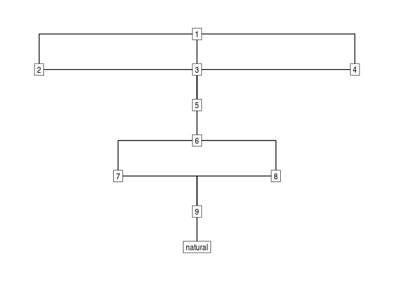

# stratigraphr

stratigraphr is a tidy framework for working with archaeological
stratigraphy and chronology in R. It includes tools for reading,
analysing, and visualising stratigraphies (Harris matrices) and
sequences as directed graphs; helper functions for using radiocarbon
dates in a tidy data analysis; and an R interface to OxCal’s
Chronological Query Language (CQL).

## Installation

You can install the development version of stratigraphr from GitHub with
[pak](https://pak.r-lib.org/):

``` r

# install.packages("pak")
devtools::install_github("joeroe/stratigraphr")
```

## Usage

[`stratigraph()`](https://stratigraphr.joeroe.io/reference/stratigraph.md)
uses a data frame of stratigraphic relations to construct a
*stratigraphic graph*:

``` r

library(stratigraphr)

# Example stratigraphy from Harris (1979), figure 12:
harris12
#>    context   above   below equal
#> 1        1      NA 2, 3, 4  <NA>
#> 2        2       1       5  <NA>
#> 3        3       1       5  <NA>
#> 4        4       1       5  <NA>
#> 5        5 2, 3, 4       6  <NA>
#> 6        6       5    7, 8  <NA>
#> 7        7       6       9     8
#> 8        8       6       9     7
#> 9        9    7, 8 natural  <NA>
#> 10 natural       9      NA  <NA>

stratigraph(harris12, "context", "above")
#> # A stratigraph: 10 units and 12 relations
#> # ✔ Valid stratigraphic graph
#>                 1
#> ┌───────────────┼───────────────┐
#> 2               3               4
#> └───────────────┼───────────────┘
#>                 5
#>                 │
#>                 6
#>         ┌───────┴───────┐
#>         7               8
#>         └───────┬───────┘
#>                 9
#>                 │
#>              natural
```

stratigraph objects are built on top of
[tidygraph](https://tidygraph.data-imaginist.com/), which gives access
to a powerful tidy interface for manipulating and analysing the
stratigraphy. It also works seamlessly with
[ggraph](https://ggraph.data-imaginist.com/). For example, to
approximate a conventional ‘Harris matrix’ visualisation with ggraph:

``` r

library("ggraph")
#> Loading required package: ggplot2

# Example data after Harris 1979, Fig. 12
harris12 |>
  stratigraph("context", "above") |>
  ggraph(layout = "sugiyama") +
    geom_edge_elbow() +
    geom_node_label(aes(label = context), label.r = unit(0, "mm")) +
    theme_graph()
```



For further information on:

- **Graph-bases stratigraphic analysis**, see
  [`vignette("stratigraphr")`](https://stratigraphr.joeroe.io/articles/stratigraphr.md).
- **Chronological query language**, see
  [`vignette("cql")`](https://stratigraphr.joeroe.io/articles/cql.md).

This package previous contained functions for tidy radiocarbon data.
These were deprecated in v0.3.0 and moved to the
[c14](https://c14.joeroe.io) package. See [c14’s introductory
vignette](https://c14.joeroe.io/articles/c14.html) for further
information.
